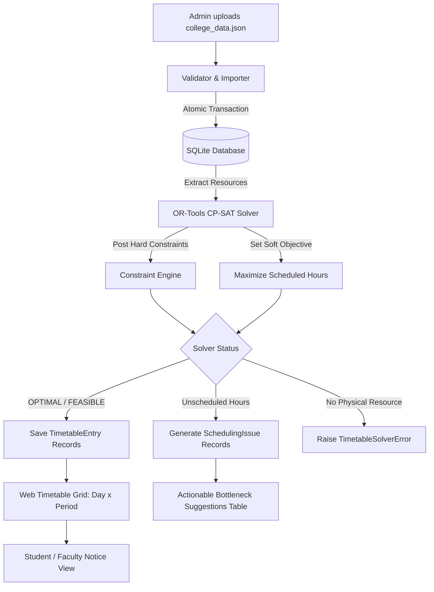

## ⚡ Quick Start: Steps to Run This Project

### Step 1: Navigate to the Project Directory

cd C:\Users\hp\.gemini\antigravity\scratch\timetable_project

### Step 2: Install Dependencies

pip install -r requirements.txt

### Step 3: Apply Database Migrations

python manage.py migrate

### Step 4: Import Sample College Data via CLI

python manage.py import_college_data sample_college_data.json

### Step 5: (Optional) Create an Admin User

python manage.py createsuperuser

# (A default admin is already created: admin / admin123)

### Step 6: Start the Development Server

python manage.py runserver

### Step 7: Open in Your Browser

- 📊 Main Dashboard: http://127.0.0.1:8000/
- 📤 Upload JSON Data: http://127.0.0.1:8000/upload/
- ⚙️ Generate Timetable: http://127.0.0.1:8000/generate/
- 📅 Interactive Timetable Grid: http://127.0.0.1:8000/timetable/
- 🔐 Django Admin Panel: http://127.0.0.1:8000/admin/ (admin / admin123)

### 🧪 Run Automated Tests

python manage.py test

# Automatic Timetable Generator: Complete Technical & Academic Guide

A Django-based, conflict-free college timetable generation system powered by **Google OR-Tools CP-SAT (Constraint Programming - Satisfiability)** and **SQLite**.

This application solves the university course timetabling problem (UCTP) for all college divisions (1st through 4th year) covering an entire semester from a single JSON input file. It features mathematical conflict-elimination guarantees, soft-objective optimization for over-committed workloads, automated bottleneck diagnostics, and a responsive web interface with print-ready timetable grids.

---

## ⚡ Quick Start: Steps to Run This Project

Follow these 6 steps to get the application running immediately:

### Step 1: Navigate to the Project Directory

Open your terminal (PowerShell or Command Prompt) and change into the project directory:

```powershell
cd C:\Users\hp\.gemini\antigravity\scratch\timetable_project
```

### Step 2: Install Dependencies

Install Django and Google OR-Tools using `requirements.txt`:

```powershell
pip install -r requirements.txt
```

_(Or manually: `pip install django ortools`)_

### Step 3: Apply Database Migrations

Initialize the SQLite database schema:

```powershell
python manage.py migrate
```

### Step 4: Import Sample College Data via CLI

Populate the database with the pre-configured college data (semesters, divisions, rooms, subjects, and teacher allocations):

```powershell
python manage.py import_college_data sample_college_data.json
```

### Step 5: (Optional) Create an Admin User

A default admin account is already created (`admin` / `admin123`). To create a new one:

```powershell
python manage.py createsuperuser
```

### Step 6: Start the Development Server

```powershell
python manage.py runserver
```

### Step 7: Open in Your Browser

Once the server starts, navigate to:

- 📊 **Main Dashboard**: [http://127.0.0.1:8000/](http://127.0.0.1:8000/)
- 📤 **Upload JSON Data**: [http://127.0.0.1:8000/upload/](http://127.0.0.1:8000/upload/)
- ⚙️ **Generate Timetable & View Issues**: [http://127.0.0.1:8000/generate/](http://127.0.0.1:8000/generate/)
- 📅 **Interactive Division Timetable Grid**: [http://127.0.0.1:8000/timetable/](http://127.0.0.1:8000/timetable/)
- 🔐 **Django Admin Panel**: [http://127.0.0.1:8000/admin/](http://127.0.0.1:8000/admin/) _(Username: `admin`, Password: `admin123`)_

### 🧪 Run Automated Tests

Verify all 9 constraint and solver tests anytime with:

```powershell
python manage.py test
```

---

## Table of Contents

1. [Quick Start: Steps to Run This Project](#-quick-start-steps-to-run-this-project)
2. [System Architecture & Overview](#system-architecture--overview)
3. [Mathematical CSP Formulation (OR-Tools CP-SAT)](#mathematical-csp-formulation-or-tools-cp-sat)
   - [Decision Variables](#1-decision-variables)
   - [Hard Constraints (Inviolable)](#2-hard-constraints-inviolable)
   - [Soft Objective Function & Over-Commitment](#3-soft-objective-function--over-commitment)
   - [Post-Solve Diagnostics & Honest Reporting](#4-post-solve-diagnostics--honest-reporting)
4. [Database Schema (The 10 Core Models)](#database-schema-the-10-core-models)
5. [JSON Input Format & Importer Specification](#json-input-format--importer-specification)
   - [Complete Valid JSON Sample](#complete-valid-json-sample)
   - [Validation & Transaction Safety Rules](#validation--transaction-safety-rules)
6. [Web Pages & Admin Workflow](#web-pages--admin-workflow)
7. [Automated Verification & Testing Suite](#automated-verification--testing-suite)
8. [Student Presentation & Viva Guide](#student-presentation--viva-guide)

---

## System Architecture & Overview

Traditional timetable software relies on heuristic or genetic algorithms, which can produce schedule collisions or get stuck in local optima. This application frames timetabling as a **Constraint Satisfaction Problem (CSP)** solved using Google's **CP-SAT solver**:



---

## Mathematical CSP Formulation (OR-Tools CP-SAT)

### 1. Decision Variables

Let:

- $\mathcal{A}$ be the set of all course assignments for a semester, where each assignment $a \in \mathcal{A}$ is a tuple $(\text{teacher}_a, \text{division}_a, \text{subject}_a, \text{hours}_a)$.
- $\mathcal{R}$ be the set of all available rooms, partitioned into regular classrooms $\mathcal{R}_{\text{theory}}$ and laboratories $\mathcal{R}_{\text{lab}}$.
- $\mathcal{T}$ be the set of all time slots in the week (e.g. 42 slots for 6 days $\times$ 7 periods/day), strictly excluding lunch break periods.

For each assignment $a \in \mathcal{A}$, room $r \in \mathcal{R}$, and time slot $t \in \mathcal{T}$, we define a Boolean decision variable:

$$x_{a, r, t} \in \{0, 1\}$$

Where $x_{a, r, t} = 1$ if and only if assignment $a$ is scheduled in room $r$ at time slot $t$.

To optimize memory and search tree size, variables are pre-filtered during generation:

- If $a$ requires a lab and $r \in \mathcal{R}_{\text{theory}}$, $x_{a, r, t}$ is not created.
- If $a$ is a theory subject and $r \in \mathcal{R}_{\text{lab}}$, $x_{a, r, t}$ is not created.
- If teacher $\text{teacher}_a$ has declared unavailability at time slot $t$, $x_{a, r, t}$ is not created.

---

### 2. Hard Constraints (Inviolable)

These conditions can **never** be broken in any valid output:

#### Constraint 1: Teacher Concurrency

A teacher cannot teach in two places during the same time slot:
$$\sum_{a \in \mathcal{A} \,|\, \text{teacher}_a = \tau} \sum_{r \in \mathcal{R}} x_{a, r, t} \le 1 \quad \forall \tau \in \text{Teachers}, \, \forall t \in \mathcal{T}$$

#### Constraint 2: Division Concurrency

A class division cannot attend more than one lecture or lab simultaneously:
$$\sum_{a \in \mathcal{A} \,|\, \text{division}_a = \delta} \sum_{r \in \mathcal{R}} x_{a, r, t} \le 1 \quad \forall \delta \in \text{Divisions}, \, \forall t \in \mathcal{T}$$

#### Constraint 3: Room Concurrency

A physical room or laboratory cannot host multiple classes in the same time slot:
$$\sum_{a \in \mathcal{A}} x_{a, r, t} \le 1 \quad \forall r \in \mathcal{R}, \, \forall t \in \mathcal{T}$$

#### Constraint 4: Room Type Strictness

- Laboratory subjects are mapped strictly to $r \in \mathcal{R}_{\text{lab}}$.
- Theory subjects are mapped strictly to $r \in \mathcal{R}_{\text{theory}}$.

#### Constraint 5: Teacher Unavailability

For each declared unavailable slot $t_{\text{unavail}}$ for teacher $\tau$:
$$x_{a, r, t_{\text{unavail}}} = 0 \quad \forall a \in \mathcal{A} \,|\, \text{teacher}_a = \tau, \, \forall r \in \mathcal{R}$$

#### Constraint 6: Workload Ceiling

An assignment is never scheduled for more hours than requested by the curriculum:
$$\sum_{r \in \mathcal{R}} \sum_{t \in \mathcal{T}} x_{a, r, t} \le \text{weekly\_hours}(a) \quad \forall a \in \mathcal{A}$$

#### Constraint 7: Teacher Weekly Limit

Total hours scheduled for any teacher across the week cannot exceed their contract maximum:
$$\sum_{a \in \mathcal{A} \,|\, \text{teacher}_a = \tau} \sum_{r \in \mathcal{R}} \sum_{t \in \mathcal{T}} x_{a, r, t} \le \text{max\_hours\_per\_week}(\tau) \quad \forall \tau \in \text{Teachers}$$

---

### 3. Soft Objective Function & Over-Commitment

In real college administration, data input by users is frequently over-committed (e.g., assigning a teacher 30 hours of classes in a 24-slot schedule, or requesting more hours than there are periods in a week).

If the solver enforced a hard equality constraint ($\sum x = \text{requested}$), the model would return **`INFEASIBLE`**, halting with zero output.

Instead, the model utilizes a **soft-constraint objective**:
$$\text{Maximize} \quad \mathcal{Z} = \sum_{a \in \mathcal{A}} \sum_{r \in \mathcal{R}} \sum_{t \in \mathcal{T}} x_{a, r, t}$$

- **When resources are sufficient**: The solver naturally schedules $100\%$ of requested hours because that achieves the maximum possible value of $\mathcal{Z}$.
- **When resources are constrained**: The solver produces the highest possible number of conflict-free class placements, while tracking unscheduled hours for diagnostic reporting.

---

### 4. Post-Solve Diagnostics & Honest Reporting

For any assignment where $\text{scheduled\_hours} < \text{weekly\_hours}(a)$, the system creates a **`SchedulingIssue`** entry in the database. The system calculates the exact resource bottleneck and outputs:

- **`reason`**: Explains whether the shortfall was caused by a teacher exceeding their weekly cap, high unavailability restrictions, division slot exhaustion, or conflicting peak-hour collisions.
- **`suggestion`**: Provides actionable advice (e.g., _"Increase Prof. Sharma's max hours from 20 to 24, or reassign 1st Year Division 2 to another faculty member"_).

If the problem is physically impossible (e.g., zero lab rooms exist in the database for a lab course), the solver immediately raises a descriptive **`TimetableSolverError`**.

---

## Database Schema (The 10 Core Models)

The SQLite database implements 10 specialized models:

| #   | Model                       | Key Fields                                                                             | Purpose & Business Logic                                                                                                                                                                                     |
| --- | --------------------------- | -------------------------------------------------------------------------------------- | ------------------------------------------------------------------------------------------------------------------------------------------------------------------------------------------------------------ |
| 1   | **`Semester`**              | `name`, `start_date`, `end_date`                                                       | Defines the semester bounds. Includes `number_of_weeks()` calculating `(end_date - start_date).days // 7` (minimum 1).                                                                                       |
| 2   | **`YearDivision`**          | `year`, `division_number`, `strength`, `name`                                          | Represents a cohort (e.g. "3rd Year - Division 2"). Auto-formats its `name` on save. Contains static method `generate_for_year(...)` that creates sequentially numbered cohorts without upper limits.        |
| 3   | **`Subject`**               | `name`, `is_lab`, `code`                                                               | Defines a curricular subject and distinguishes laboratory practicals from theory lectures.                                                                                                                   |
| 4   | **`Room`**                  | `name`, `is_lab`, `capacity`                                                           | Physical infrastructure. Contains static method `generate_rooms(...)` that sequentially creates "Room 1", "Room 2" and "Lab 1", "Lab 2" based on count.                                                      |
| 5   | **`TimeSlot`**              | `day`, `period_number`, `start_time`, `end_time`                                       | Represents weekly slots (`MON` through `SAT`). Unique on `(day, period_number)`. Created via helper `generate_time_slots(...)`, which automatically partitions daily hours and skips the lunch break window. |
| 6   | **`Teacher`**               | `name`, `max_hours_per_week`                                                           | Faculty profiles and contractual teaching ceilings.                                                                                                                                                          |
| 7   | **`TeacherUnavailability`** | `teacher` (FK), `time_slot` (FK)                                                       | Tracks times a teacher cannot be booked (leave, sabbaticals, part-time shifts).                                                                                                                              |
| 8   | **`Assignment`**            | `semester`, `teacher`, `subject`, `division`, `total_hours_for_semester`               | Core bridge table. Method `weekly_hours()` computes $\lceil \text{total\_hours} / \text{weeks} \rceil$. Unique together on `(semester, teacher, subject, division)`.                                         |
| 9   | **`TimetableEntry`**        | `semester`, `assignment`, `room`, `time_slot`                                          | The concrete output of the CP-SAT solver. Protected at the database level by `unique_together = ('semester', 'time_slot', 'room')`.                                                                          |
| 10  | **`SchedulingIssue`**       | `semester`, `assignment`, `hours_requested`, `hours_scheduled`, `reason`, `suggestion` | Diagnostic reporting record created whenever an assignment cannot receive its full weekly hours.                                                                                                             |

---

## JSON Input Format & Importer Specification

The system allows uploading a single JSON document containing all college data.

### Complete Valid JSON Sample

```json
{
  "college": {
    "name": "Apex Engineering Institute",
    "semester_name": "Fall Semester 2026",
    "start_date": "2026-08-03",
    "end_date": "2026-11-16",
    "working_days": ["MON", "TUE", "WED", "THU", "FRI", "SAT"],
    "daily_start_time": "09:00",
    "daily_end_time": "17:00",
    "period_duration_minutes": 60,
    "lunch_break": {
      "start_time": "13:00",
      "end_time": "14:00"
    }
  },
  "years": [
    { "year": 1, "number_of_divisions": 2, "strength_per_division": 60 },
    { "year": 2, "number_of_divisions": 2, "strength_per_division": 60 },
    { "year": 3, "number_of_divisions": 2, "strength_per_division": 55 },
    { "year": 4, "number_of_divisions": 1, "strength_per_division": 50 }
  ],
  "subjects": [
    { "id": "SUB101", "name": "Engineering Physics", "is_lab": false },
    { "id": "SUB101L", "name": "Physics Laboratory", "is_lab": true },
    { "id": "SUB102", "name": "Calculus & Linear Algebra", "is_lab": false },
    { "id": "SUB201", "name": "Data Structures & Algorithms", "is_lab": false },
    { "id": "SUB201L", "name": "DSA Practice Lab", "is_lab": true },
    { "id": "SUB301", "name": "Database Management Systems", "is_lab": false },
    { "id": "SUB301L", "name": "DBMS Systems Lab", "is_lab": true }
  ],
  "rooms": {
    "number_of_regular_rooms": 12,
    "regular_room_capacity": 70,
    "number_of_lab_rooms": 5,
    "lab_room_capacity": 60
  },
  "teachers": [
    {
      "id": "T1",
      "name": "Dr. Rohit Sharma",
      "max_hours_per_week": 20,
      "unavailable_slots": ["MON-P1", "FRI-P5"],
      "allocations": [
        {
          "year": 1,
          "division": 1,
          "subject_id": "SUB101",
          "total_hours_for_semester": 60
        },
        {
          "year": 1,
          "division": 2,
          "subject_id": "SUB101",
          "total_hours_for_semester": 60
        }
      ]
    },
    {
      "id": "T2",
      "name": "Prof. Anita Desai",
      "max_hours_per_week": 18,
      "unavailable_slots": ["SAT-P6"],
      "allocations": [
        {
          "year": 1,
          "division": 1,
          "subject_id": "SUB101L",
          "total_hours_for_semester": 30
        },
        {
          "year": 1,
          "division": 2,
          "subject_id": "SUB101L",
          "total_hours_for_semester": 30
        }
      ]
    }
  ]
}
```

### Validation & Transaction Safety Rules

The importer (`scheduler/importer.py`) enforces strict validation prior to database writes:

1. **Pre-flight Check**: Checks date formats (`YYYY-MM-DD`), logical ranges (`end_date > start_date`), 24-hour time formats (`HH:MM`), day codes (`MON` through `SAT`), and non-negative counts.
2. **Lunch Break Safety**: Verifies `lunch_break.end_time > lunch_break.start_time`. Time slots that intersect this interval are omitted from generation.
3. **Foreign Key Integrity**: Validates that all allocation references (`year`, `division`, `subject_id`) exist in their respective declaration lists.
4. **All-or-Nothing Transaction**: The entire routine runs inside `django.db.transaction.atomic()`. If any validation error or unexpected exception occurs, the transaction is rolled back, leaving the database clean.

---

## Installation & Setup Walkthrough

### 1. Requirements

Ensure Python 3.10+ is installed:

```powershell
python --version
```

### 2. Environment Setup

Install the necessary packages via `requirements.txt`:

```powershell
pip install -r requirements.txt
```

_(Or install directly: `pip install django ortools`)_

### 3. Database Initialization

Run Django migrations to build the SQLite database schema:

```powershell
python manage.py migrate
```

### 4. Create an Admin Account

Create a superuser to access the management portal:

```powershell
python manage.py createsuperuser
```

_(Default testing credentials: username `admin`, password `admin123`)_

### 5. Import College Data

Import the sample college dataset via the management command:

```powershell
python manage.py import_college_data sample_college_data.json
```

Output:

```
Validating and importing college data from: sample_college_data.json...
Successfully imported data for semester 'Fall Semester 2026'!
  - Created 7 YearDivisions
  - Created 11 Subjects
  - Created 17 Rooms
  - Created 7 Teachers
  - Created 20 Assignments
  - Generated 42 TimeSlots
```

### 6. Run the Server

```powershell
python manage.py runserver
```

The application will be live at:

- **Dashboard**: `http://127.0.0.1:8000/`
- **Upload JSON**: `http://127.0.0.1:8000/upload/`
- **Generate Timetable**: `http://127.0.0.1:8000/generate/`
- **Timetable View**: `http://127.0.0.1:8000/timetable/`
- **Django Admin**: `http://127.0.0.1:8000/admin/`

---

## Web Pages & Admin Workflow

### 1. Web-based JSON Upload (`/upload/`)

- Allows administrators to upload a `.json` file from any browser.
- Displays friendly inline error messages if required keys or schema invariants are violated.

### 2. Generator & Issues Dashboard (`/generate/`)

- Displays target semester parameters.
- Contains a **"Run CP-SAT Solver"** button that invokes `generate_timetable(semester.id)`.
- If 100% of hours are placed, a green confirmation badge is shown.
- If over-commitment occurs, renders a table displaying:
  - Division & Subject
  - Teacher Name
  - Hours Requested vs Hours Scheduled
  - Specific Bottleneck Reason
  - Actionable Suggestion

### 3. Division Timetable Grid (`/timetable/`)

- Dropdown selector for **Semester** and **Year & Division** (e.g. _1st Year - Division 2_).
- Renders a clean Day $\times$ Period table:
  - **Columns**: Monday through Saturday (configured working days).
  - **Rows**: Period 1 through Period $N$ with time boundaries.
  - **Cells**: Course Name, Lab indicator badge, Teacher Name, Room Name, and Room Capacity.
  - Built-in **Print / PDF** button with print stylesheet hiding navigation chrome.

### 4. Faculty Management & Instant Regeneration in Django Admin

- Navigate to `/admin/scheduler/assignment/`.
- Replace a teacher on any assignment.
- Upon saving, a prompt with an embedded link allows the administrator to trigger an immediate timetable re-solve.
- Bulk admin actions also allow selecting multiple assignments to regenerate their parent semester's timetable in one click.

---

## Automated Verification & Testing Suite

The application includes an automated test suite in `scheduler/tests.py` containing 9 comprehensive tests.

Run the test suite with:

```powershell
python manage.py test
```

### Key Verification Tests:

1. **`test_import_and_independent_solver_verification`**:
   - Imports a multi-year, multi-faculty college schedule.
   - Executes the solver.
   - Independently queries the resulting database rows to confirm:
     - No teacher has duplicate bookings in the same period.
     - No division has two classes in the same period.
     - No room has multiple cohorts in the same period.
     - Lab classes are strictly placed in lab rooms.
     - Teacher unavailability slots are strictly honored.
2. **`test_overcommitted_scenario_reports_scheduling_issue`**:
   - Deliberately starves a teacher of available hours while assigning high lecture requirements.
   - Verifies that the solver does not crash or return empty results.
   - Confirms that `SchedulingIssue` records are generated with non-empty reasons and suggestions.
3. **`test_lunch_break_exclusion`**:
   - Verifies that `generate_time_slots` correctly omits periods overlapping the configured lunch window and numbers subsequent periods sequentially.
4. **`test_missing_room_raises_solver_error`**:
   - Verifies that requesting a lab course without having any lab rooms in the facility raises `TimetableSolverError`.
5. **`TimetableWebViewsTestCase`**:
   - End-to-end integration tests verifying HTTP 200 responses and template rendering for the Dashboard, Upload, Generator, and Grid views.

---

## Student Presentation & Viva Guide

When explaining this project to evaluators or professors, keep these points in mind:

### 1. Why Google OR-Tools CP-SAT instead of Genetic Algorithms or Backtracking?

- **Genetic Algorithms (GA)** are stochastic approximations. They often stop at 95% feasibility, leaving occasional double-bookings that require manual fixing.
- **Pure Backtracking** has exponential worst-case time complexity $\mathcal{O}(d^n)$ and easily crashes or hangs on large academic datasets.
- **CP-SAT (Constraint Programming with Boolean Satisfiability)** transforms the timetable constraints into boolean clauses. It uses conflict-driven clause learning (CDCL) and integer programming cuts to solve schedules with thousands of variables in a few seconds.

### 2. How are conflicts mathematically prevented?

- Mutual exclusivity is enforced through linear inequalities ($\sum x \le 1$).
- At the database level, SQLite enforces `unique_together = ('semester', 'time_slot', 'room')` on the `TimetableEntry` table, preventing physical room collisions even in the event of external data modifications.

### 3. What happens if a teacher is assigned more hours than the college has slots?

- The model treats class volume as a soft objective (`Maximize sum(x)`).
- It places as many conflict-free hours as mathematically possible.
- It then calculates which constraints restricted the remaining hours and outputs a `SchedulingIssue` explaining the conflict to the administrator.

### 4. How are lunch breaks handled?

- Rather than adding complex dynamic "do-not-schedule" constraints, the system excludes the lunch hour during `TimeSlot` generation. Since slots within the lunch window do not exist in the database, classes can never be scheduled during lunch.
